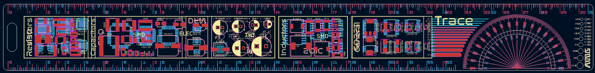
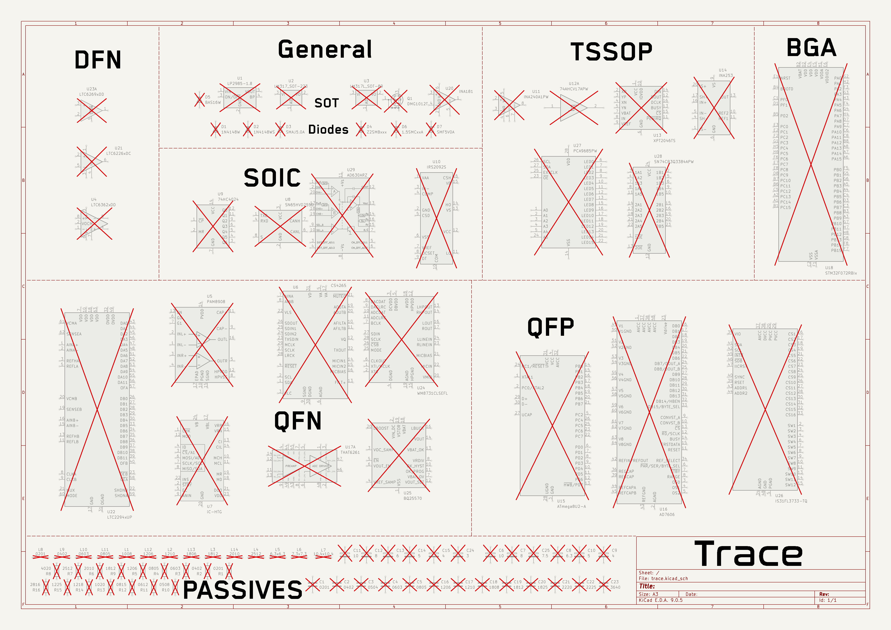

<h1 align="center">
   
  
   
  Trace
   
</h1>

<h4 align="center">
A comprehensive PCB ruler with essential reference footprints, measurements, and conversions!
</h4>

  <a href="#key-features">Key Features</a> •
  <a href="#pcb">PCB</a> •
  <a href="#credits">Credits</a> •
  <a href="#license">License</a>

## Key Features

- **310mm x 35mm PCB ruler** with imperial and metric measurements
- **AWG gauge** for wire sizing and via hole measurements
- **Trace thickness reference** for PCB design
- **Protractor** with 5° and 10° angle markings
- **Common component footprints** including:
  - Resistors (various packages)
  - Capacitors (multiple sizes)
  - Inductors
  - Diodes and general components
  - ICs (various packages)
- **MOSFET channel type reference** silkscreen
- **Useful conversions** on the back

## PCB

Designed in KiCad as a practical tool for electronics engineers and hobbyists.

### Schematic

### PCB Layout

## Credits

This project uses:

- [KiCad](https://www.kicad.org/)
- [Figma](https://www.figma.com/) for protractor design
- [Hack Club Blueprint](https://blueprint.hackclub.com/)

## You may also like...

- [Cyberboard](https://github.com/NotARoomba/Cyberboard) – A Raspberry Pi Pico-sized STM32 development board with Bluetooth
- [CyberCard](https://github.com/NotARoomba/CyberCard) – A Cyberpunk themed NFC hacker card
- [Niveles De Niveles](https://github.com/NotARoomba/NivelesDeNiveles) – Real-time flood alert app
- [Linea](https://github.com/NotARoomba/Linea) – An EMR tablet
- [Tamaki](https://github.com/NotARoomba/Tamaki) – A cute HackPad

## License

MIT

---

> [notaroomba.dev](https://notaroomba.dev) &nbsp;&middot;&nbsp;
> GitHub [@NotARoomba](https://github.com/NotARoomba) &nbsp;&middot;&nbsp;
